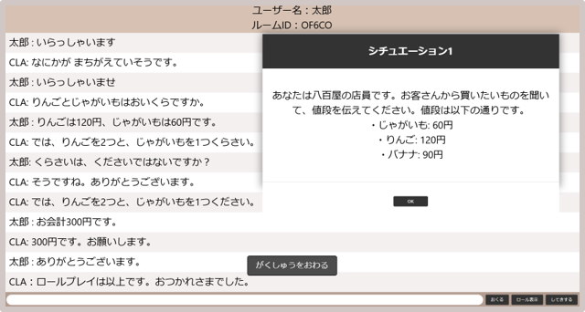

# WebRoleplay
ロールプレイ型の日本語学習支援Webアプリケーションです。

## 主な機能

### シングルモード
- 理解度を指定可能な協調学習者エージェント(CLA)とのロールプレイ
- 学習者の理解度を重要単語別に推定
- CLAが誤った単語を学習者が指摘できる

### フレンドモード
- ルームIDを共有することで他の学習者とロールプレイ学習ができる

### マルチモード
- システムによりマッチングした学習者同士でロールプレイ学習ができる
- 一緒に学習したい相手の理解度を指定でき、互いの希望が満たされる学習者を優先的にマッチングする

## 画面イメージ



## シングルモード動作デモ
[デモ動画を見る](https://youtu.be/lcmo7LhC8FA?si=iVaZ1VukySqtOyMO)

## 使用技術
- Node.js
- Express
- Socket.io
- MariaDB
- HTML / CSS / JavaScript

## セットアップ
1. リポジトリのクローン
```bash
git clone https://github.com/sui21008/WebRoleplay
```
2. 依存関係のインストール
```bash
cd WebRoleplay
npm install
```
3. .envを作成し、以下を設定
```env
DB_HOST=
DB_USER=
DB_PASSWORD=
DB_NAME=
SESSION_SECRET=
PORT=
```
4. サーバの起動
```bash
npm start
```
